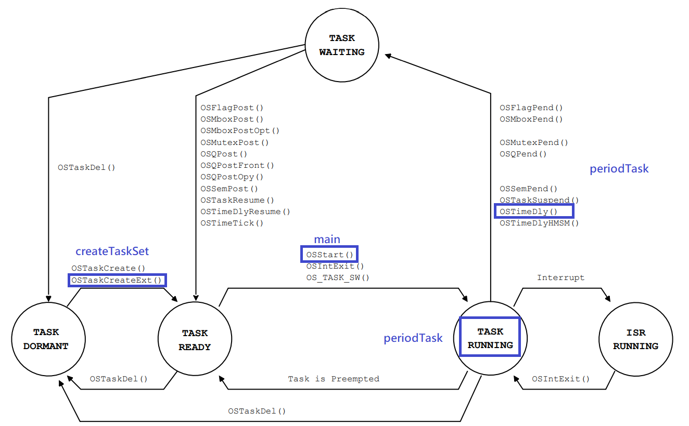
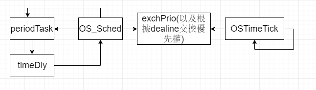

1. RM

   1. 每個函數之間的關係

      1. main.c檔 
         1. main 負責初始化作業系統相關資源後，呼叫 createTaskSet 建立任務，然後再呼叫 OSStart 開始執⾏多任務
         2. createTaskSet 負責讀檔得到任務數量與執⾏時間和週期等資訊後建立週期性任務，會根據依序挑 出週期最⼩的⼯作，以遞增優先權值的⽅式建立任務(呼a叫 OSTaskCreateExt ) 
         3. periodTask ⼀個任務會執⾏的函數，內部就是無窮迴圈，當任務執⾏的剩餘時間歸零時，會重 新計算deadline、將剩餘時間回復到滿，然後呼叫 OSTimeDly 變成waiting狀態的 任務直到時間到才變回ready狀態 
      2. os_core.c檔
         1. OSTimeTick 每次每⼀執⾏1 tick的時間就會呼叫此函數，需要把⽬前執⾏的週期性任務的 CompTime (執⾏剩餘時間)減1，以及遍歷所有任務將有 OSTCBDly 的任務的 OSTCBDly-- ( OSTimeDly 延遲的剩餘時間)，並且將 OSTCBDly 為0的⼯作變為 ready狀態
         2. OS_Sched 會判斷⽬前最⾼優先權的⼯作，如果最⾼優先權的⼯作不是當前執⾏的⼯作就做 context switch 3. OS_TCBInit 每個任務都會有它的TCB(task control block)，紀錄⼀些任務的相關資訊，像是要 delay多久才加到ready list、⽬前的狀態、優先度、任務的堆疊指標、任務的id等 資訊。 這邊會新增幾個新的欄位，有 CompTime (剩餘執⾏時間)、 StartTime 開始執⾏時 間)、 Deadline (截⽌時間)，如果是extend task就會有這些欄位

   2. 實作的流程圖
      上圖是函數跟任務狀態切換的關係 ⼀開始的main函數會做作業系統的初始化，然後呼叫 createTaskSet 建立週期性任務 ( OSTaskCreateExt )，如圖所⽰， createTaskSet 會讓新建的任務在ready狀態，以及根據 週期指定優先度，後⾯在呼叫 OSStart 挑選⼀個最⾼優先權的任務變成task running狀態， 執⾏的任務會執⾏ periodTask ， periodTask 的執⾏時間做完後會重新計算deadline等資 訊以及要休息的時間然後呼叫 OSTimeDly 休息到deadline再變成task ready狀態跟著其他任 務競爭cpu

   3. 實作的細節(講解部分在註解)
      修改OS_TCB的結構，加入 CompTime (剩餘執⾏時間)、 StartTime 開始執⾏時間)、 Deadline (截⽌時間)

      ```c
      typedef struct os_tcb {
      // 前略
      INT32U CompTime; /* 剩餘執⾏時間 */
      INT32U StartTime; /* 開始時間 */
      INT32U Deadline; /* 截⽌時間 */
      // 後略
      }
      ```

      依序挑選最短周期的欲建立任務，然後以⾼到低優先權依序建立

      ```c
      typedef struct os_tcb {
      // 前略
          INT32U CompTime; /* 剩餘執⾏時間 */
          INT32U StartTime; /* 開始時間 */
          INT32U Deadline; /* 截⽌時間 */
      // 後略
      }
      for (int i = 0; i < NumberOfTasks; i++)
      {
          int minPeriod = 100000000;
          int minPeriodTaskIndex = 0;
          for (int j = 0; j < NumberOfTasks; j++) // 遍歷找到還沒有被挑的最⼩週期任務
          {
              if (taskTimeInfos[i][2]-taskTimeInfos[i][1] < minPeriod) {
              	int hasIn = 0;
              	for (int k = 0; k <= i; k++) // 檢查此任務是否被挑過
              	{
                  	if (hasAssignedTask[k] == j) {
                  		hasIn = 1;
                      }
                  }
                 if (hasIn == 0) { // 沒有被挑過就紀錄⽬前的暫時是最⼩週期的任務
                      minPeriod = taskTimeInfos[j][2] - taskTimeInfos[i][1];
                      minPeriodTaskIndex = j;
                      hasAssignedTask[i] = j;
      			}
      		}
      	}
      	OSTaskCreateExt(...); // 建立被挑的那個任務，優先權從20遞增(數字越⼩越優先)
      }
      ```

2. EDF(有⼀些部份跟RM相同就不多贅述)

   1. 每個函數之間的關係
      1. main.c檔(跟RM相似，只差在挑deadline最⼩的⽽不是挑period最⼩的)
      2. os_core.c檔
         1. OSTimeTick
            1. 將週期性任務的CompTime-1
            2. 要根據deadline交換優先權(呼叫 OSTaskChangePrio )
         2. OS_Sched
            1. 要根據deadline交換優先權再排程(呼叫 OSTaskChangePrio)
            2. 觸發時機: 1. 當週期性任務 periodTask 呼叫 timeDly 時，會將其移出 readylist並且呼叫 OS_Sched 2. 當週期性任務 periodTask 呼叫 timeDly 之 後時間到，會在 OSTimeTick 觸發 OS_Sched
         3. OSTaskChangePrio(⾃⼰定義的函數)
            將兩個任務的優先權交換，在OSTImeTick和OS_Sched時要呼叫，因為要挑最早的 deadline任務來做
      3. os_task.c檔
         1. OSTaskChangePrio
            將原本某個優先權的任務換成另外⼀個優先權，會改到優先權與OS_TCB的表 ~ OSTCBPrioTbl 以及準備執⾏任務的表~ OSRdyTbl 。然後 OSTaskChangePrio 會 呼叫此函數來完成兩任務優先權交換。將呼叫OS_Sched的部分註解掉。

   2. 實作的流程圖

   3. 實作的細節(講解部分在註解)
      OSTimeTick和OS_Sched的根據deadline交換優先權的部分

      ```c
      OS_TCB* ptcb = OSTCBList; // 得到指向OS_TCB list的第⼀個任務的tcb
      OS_TCB* hptcb = OSTCBPrioTbl[PERIODIC_TASK_START_PRIO]; // 得到指向⽬前
      priority最⾼的TCB指標
      while (ptcb->OSTCBPrio != OS_TASK_IDLE_PRIO) { // 把所有任務⾛過⼀遍
          // 確定此任務是週期性⼯作且不在waiting
          if (ptcb->OSTCBDly == 0u && ptcb->OSTCBExtPtr != 0 && hptcb->OSTCBExtPtr != 0) {
      		// 只要最⾼優先權的⼯作有delay且不是⽬前遍歷的任務就交換優先權，把最⾼優先權的⼯作換掉
          if (hptcb->OSTCBDly != 0u && hptcb != ptcb) {
              exchPrio(hptcb->OSTCBPrio, ptcb->OSTCBPrio);
              hptcb = ptcb;
          }
          // 如果兩者deadline相同就看其他條件決定要不要交換
          if (ptcb->Deadline == hptcb->Deadline) {
          	INT32U restTime = ptcb->Deadline - OSTimeGet();
              // 如果在deadline前兩者都能做完，就ID⼩的先做，如果⽬前遍歷的任務ID較⼩就交換優先權
              if ((ptcb->CompTime + hptcb->CompTime) > restTime) {
                  if (ptcb->OSTCBId < hptcb->OSTCBId) {
                      exchPrio(hptcb->OSTCBPrio, ptcb->OSTCBPrio);
                      hptcb = ptcb;
                  }
      		} // 如果deadline前只有⼀個能做完就挑最早能執⾏的
              else if (ptcb->StartTime < hptcb->StartTime) {
                  exchPrio(hptcb->OSTCBPrio, ptcb->OSTCBPrio);
                  hptcb = ptcb;
              }
           } // 如果⽬前遍歷的任務的deadline比⾼優先權的早就兩者對換
           else if (ptcb->Deadline < hptcb->Deadline) {
           	exchPrio(hptcb->OSTCBPrio, ptcb->OSTCBPrio);
          	hptcb = ptcb;
           }
           ptcb = ptcb->OSTCBNext; // 將⽬前遍歷的任務改成下⼀個
          }
      ```

      ​	exchPrio

      ```c
      INT8U tempPrio = 59u;
      OSTaskChangePrio(prio1, tempPrio); // 先把prio1的任務換到tempPrio的位置
      OSTaskChangePrio(prio2, prio1);// 先把prio2的任務換到prio1的位置
      OSTaskChangePrio(tempPrio, prio2); // 最後把tempPrio的任務換到prio2的位置
      ```

      

